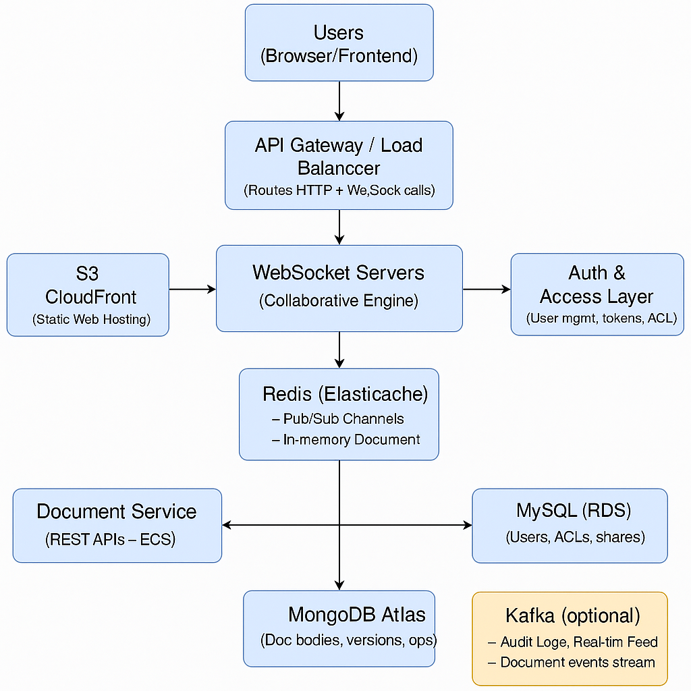

# realtime-document-editor
Real-Time Collaborative Document Editor

High Level Design

Key Interactions

    Frontend (React/Next.js)

        Connects to WebSocket for real-time editing.

        Calls REST API to load/save documents, manage users, etc.

    WebSocket Servers

        Handle user presence, document updates.

        Coordinate real-time changes via Redis pub/sub.

    Redis

        Maintains active document states.

        Syncs edits across WebSocket server nodes (broadcast model).

    MongoDB

        Stores document structure, content, and version history.

        Can serialize CRDTs or structured deltas.

    MySQL

        Manages users, roles, permissions, sharing.

    Kafka (optional, but useful at scale)

        Logs all operations for audit/versioning/analytics.

        Feeds data pipelines or dashboards.

